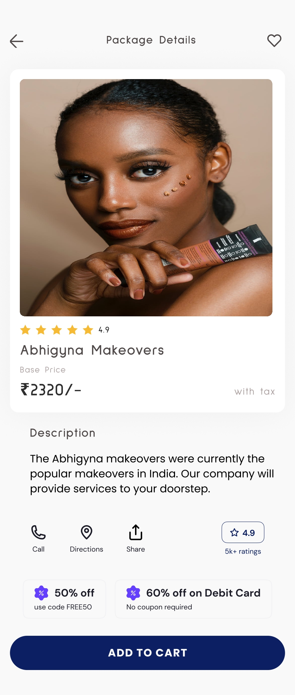
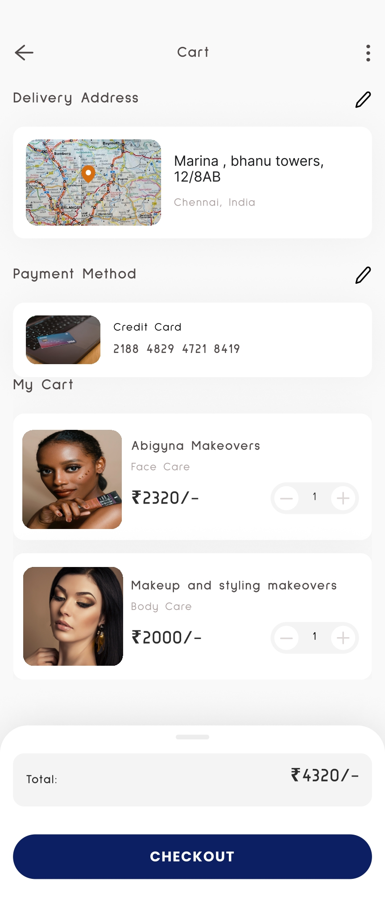

# Flutter_sample_E-Commerce
This repository contains a sample E-Commerce mobile application developed using Flutter technology. The app provides a basic framework for building an E-Commerce platform with essential features such as product listings, Product Details, cart management.
You can Download it from <a href="https://drive.google.com/file/d/1a7Dle4S8AjJfmlbAeIwhK4kGcWD0hr-i/view?usp=sharing">Here</a>.

### Screenshot

  
  
  

### Features
- Product Listings: Browse through a variety of products available in different categories.
- Product Details: View detailed information about each product including images, descriptions, prices, and ratings.
- Shopping Cart: Add products to your cart, update quantities, and proceed to checkout.

